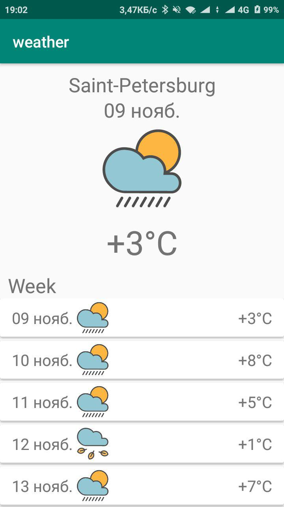

# Homeworks of android course

description, links, and other come soon

## 1. calculator

## 2. weather

and how it's look

## 3. contacts

## 4. image loader

## 5. navigation

## 6. game loader

## 7. weather forecast

## 9. tests for third homework

